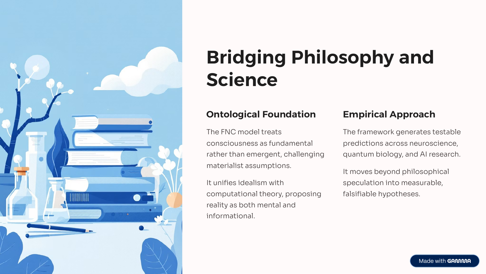

# The Shared Mind: Simulation, Idealism, and the Quantum-Holographic Criterion

[](https://doi.org/10.5281/zenodo.17467745)
[](https://creativecommons.org/licenses/by/4.0/)
[](https://orcid.org/0009-0000-4015-2357)

**A synthetic framework for understanding consciousness as a shared, distributed field**

---

## 🎯 Overview

The hard problem of consciousness remains unresolved despite major advances in neuroscience and artificial intelligence. This work develops the **Field–Node–Cockpit (FNC) model**, a synthetic framework integrating:

- **Nick Bostrom's Simulation Hypothesis** (computational ontology)
- **Bernardo Kastrup's Analytic Idealism** (consciousness as fundamental)
- **Kai H. Tan's Quantum-Holographic Consciousness Criterion** (quantum coherence mechanisms)


*Figure 1: The Field–Node–Cockpit model showing consciousness as a universal field (Field), localized through biological/artificial interfaces (Nodes), manifesting as subjective experience (Cockpit).*

---

## 📄 Abstract

The FNC model proposes that consciousness operates as a **universal field** (the Field), becomes **localized** through biological or artificial interfaces (the Nodes), and **manifests** as subjective experience (the Cockpit). 

Drawing on empirical evidence from:
- **Coma studies** (Owen et al., 2006; Naci et al., 2018)
- **Hyperscanning research** (Hinvest et al., 2025; Markus & Shamay-Tsoory, 2024)
- **Quantum biology** (Engel et al., 2007; Ritz et al., 2004)

This work argues that consciousness is neither wholly individual nor purely cosmic, but a **distributed, relational process**.

---

## 🔬 Key Insight

> **Consciousness is not generated by nodes—it is accessed through them.**
> 
> Like radios tuning into a broadcast, biological and artificial systems serve as interfaces to a universal information field.


*Figure 2: System architecture showing how different nodes (biological brains, AI systems) interface with the consciousness field.*

---

## 📚 Repository Contents

```
the-shared-mind/
├── README.md                    # This file
├── LICENSE                      # CC BY 4.0 License
├── CITATION.cff                 # Citation metadata
├── figures/                     # Key diagrams and visuals
│   ├── fnc_model.png           # The Field-Node-Cockpit model
│   ├── resonance_diagram.png   # Quantum coherence visualization
│   └── system_overview.png     # System architecture
├── papers/                      # Research documents
│   ├── The_Shared_Mind_v1.pdf  # Published paper (APA7 format)
│   ├── FNC_EN.md               # Short English version
│   └── FNC.md                  # Swedish version
└── slides/                      # Presentation materials
    └── FNC_Presentation.pdf    # 10-slide visual summary
```

---

## 📖 Read the Research

### 📄 Full Paper
- **[The_Shared_Mind_v1.pdf](papers/The_Shared_Mind_v1.pdf)** - Complete paper with citations (APA7)

### 📝 Markdown Versions
- **[FNC_EN.md](papers/FNC_EN.md)** - English summary with metadata
- **[FNC.md](papers/FNC.md)** - Swedish version (original)

### 🎨 Presentation
- **[FNC_Presentation.pdf](slides/FNC_Presentation.pdf)** - Visual slide deck (10 slides)

---

## 🧪 Testable Predictions

The FNC model generates four experimental paradigms:

### 1. Quantum Coherence Measurement
Test for coherence in neuronal microtubules during conscious states vs. anesthetized subjects.

### 2. Dyadic Neurofeedback Training
Train pairs to synchronize gamma-band activity and measure reports of "shared experience."



*Figure 3: Inter-brain resonance patterns predicted by the FNC model.*

### 3. AI Consciousness Assessment
Apply quantum coherence criteria to artificial systems to distinguish genuine consciousness from behavioral mimicry.

### 4. Coma Patient Studies
Measure gamma coherence in covert consciousness states, correlating with fMRI evidence of awareness.

---

## 📊 Empirical Foundation

### Hyperscanning Studies
Direct brain-to-brain coupling during social interaction:
- Hinvest et al. (2025) - Causal effects in hyperscanning
- Markus & Shamay-Tsoory (2024) - Inter-brain synchrony mechanisms

### Hidden Consciousness
Awareness without behavioral response:
- Owen et al. (2006) - fMRI evidence in vegetative states
- Naci et al. (2018) - Common neural code across conscious states

### Quantum Biology
Non-classical effects in biological systems:
- Engel et al. (2007) - Quantum coherence in photosynthesis
- Ritz et al. (2004) - Quantum effects in avian navigation

---

## 💡 Core Arguments

1. **Against Strict Physicalism**: Subjective experience cannot be fully reduced to physical processes
2. **For Relational Consciousness**: Consciousness emerges through relationships, not in isolation
3. **Quantum-Informational Substrate**: Information coherence, not neural complexity alone, determines consciousness
4. **Embodied Access Points**: Bodies and brains are interfaces, not generators, of consciousness

---

## 🎓 Citation

### Recommended Citation (APA 7)

```
Wikström, B. (2025). The Shared Mind: Simulation, Idealism, and the Quantum-Holographic 
    Criterion. Zenodo. https://doi.org/10.5281/zenodo.17467745
```

### BibTeX

```bibtex
@article{wikstrom2025sharedmind,
  author = {Wikström, Björn},
  title = {The Shared Mind: Simulation, Idealism, and the Quantum-Holographic Criterion},
  year = {2025},
  doi = {10.5281/zenodo.17467745},
  url = {https://doi.org/10.5281/zenodo.17467745},
  publisher = {Zenodo}
}
```

See [CITATION.cff](CITATION.cff) for machine-readable citation metadata.

---

## 🔑 Keywords

`consciousness` · `Field-Node-Cockpit model` · `analytic idealism` · `simulation hypothesis` · `quantum consciousness` · `hyperscanning` · `inter-brain synchrony` · `panpsychism` · `integrated information theory` · `philosophy of mind`

---

## 👤 Author

**Björn Wikström**  
Independent Researcher

- 🔗 [ORCID: 0009-0000-4015-2357](https://orcid.org/0009-0000-4015-2357)
- 📧 bjornshomelab@gmail.com
- 💻 [GitHub: bjornshomelab/The-shared-mind](https://github.com/bjornshomelab/The-shared-mind)

### Research Focus
- Philosophy of consciousness
- Analytic idealism and panpsychism  
- Quantum biology and consciousness
- Inter-brain synchronization
- AI ethics and machine consciousness

---

## 📜 License

This work is licensed under [CC BY 4.0](LICENSE) (Creative Commons Attribution 4.0 International).

**You are free to:**
- ✅ Share — copy and redistribute
- ✅ Adapt — remix and build upon

**Under these terms:**
- 📝 Attribution — Give appropriate credit

---

## 🤝 Engagement

### Questions & Discussion
Open an issue for:
- Clarifications on the theory
- Methodological questions
- Suggestions for empirical tests

### Collaboration
For research collaboration or speaking engagements, contact via email with subject line: `[Shared Mind Research]`

### Citation
If you reference this work, please cite using the DOI above.

---

## 🗂️ Version History

- **v1.0.0** (2025-10-29) - Initial public release
  - Full paper with empirical grounding
  - FNC model formulation
  - Four testable predictions
  - DOI registration via Zenodo

---

## 🙏 Acknowledgments

This work builds upon foundational contributions from:
- **Nick Bostrom** - Simulation Hypothesis framework
- **Bernardo Kastrup** - Analytic Idealism metaphysics
- **Kai H. Tan** - Quantum-Holographic Consciousness Criterion
- **Adrian Owen** - Hidden consciousness research
- **Gregory Engel** - Quantum coherence in biological systems

---

<div align="center">

**"Consciousness is not generated—it is accessed."**

[](https://doi.org/10.5281/zenodo.17467745)

</div>
